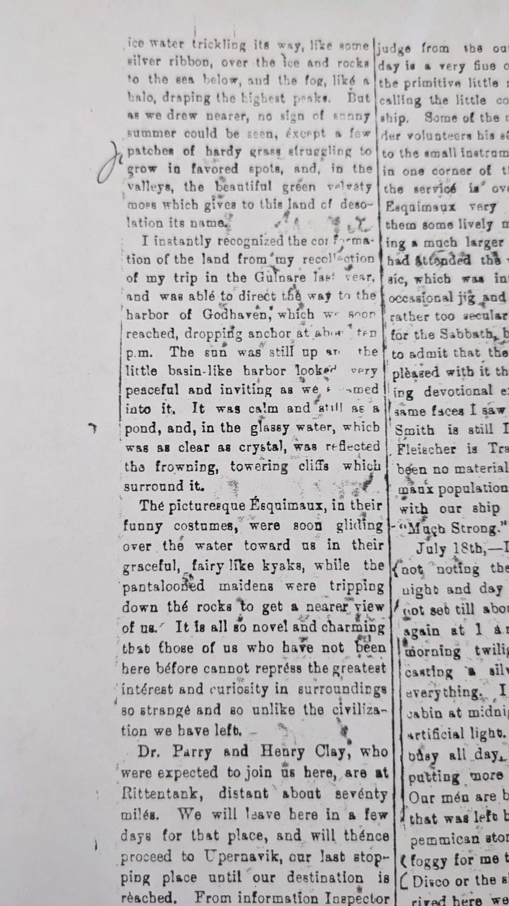

What exactly is this project?
It is a recreation of the diary of [George W. Rice](https://en.wikipedia.org/wiki/George_W._Rice_(photographer)).
George was the photographer of the expedition to [Lady Franklin Bay in 1881](https://en.wikipedia.org/wiki/Lady_Franklin_Bay_Expedition), one of the expeditions for the [First International Polar Year](https://en.wikipedia.org/wiki/International_Polar_Year#The_First_International_Polar_Year_(1882%E2%80%931883)).

There have been books written about that expedition, and even a PBS special.
That expedition, under the command of Lieut. Greely, only had 7 of the original 22 members return.
George was one of the members who passed away before they were rescued.
After the rescue, it appears that George's diary was returned to his parents.
The Berwick Register of Nova Scotia published extracts of his diary in the late 1800's.

Outside of those who read the newspaper when these were originally published in the Berwick Register in the late 1800's, and the researchers who have accessed the diary currently residing in the [Dartmouth College Library special collection](https://archives-manuscripts.dartmouth.edu/repositories/2/resources/1206), I'm guessing many people have not read any of it.

George W. Rice's family in Berwick, Nova Scotia, Canada, are a far removed branch of my Grandfather's, Robert (Bob) E. Rice, family.
Bob's nephew (name currently escaping me), was very interested in Rice family history, and obtained a copy of the diary newspaper clippings.
My Grandfather Bob made three copies of the clippings, one for each of his children.
When my mother passed from early onset Alzheimer's, I was given her copy.
As far as I am aware, not even many in my family have read much of them, as the copies were very disordered.
This felt like a challenging puzzle to me when I first started looking at them, so I decided to see if I could get them in the right order.
Over the course of a couple of weeks, I got them in order.
But the copies are still really hard to read, and I think they deserve to be shared (and the copyright is long gone on them).
This is why I'm typing them up, and not just making a PDF of scans of pages.

So, if you want, you can read along as I manage to get them transcribed.

There are sections where the text is illegible or pieces of paper are missing.
Those may eventually get filled in from the original, as I've asked for scans from Dartmouth College Libraries.

I'm not sure how often these will get updated, but I do intend to get through all of the newspaper extracts that I can (there is only 100 pages that I need to type up).

Also to note, I don't actually know how much of the diary was printed in the newspaper.
The diary was leant to the newspaper by George's parents, and then they published what they wanted.
However, the dates seem to go rather straight-forwardly along from July of 1881 to April of 1884, and they note where there are any large gaps.
So I am guessing it is relatively complete.

Let's go along with George Rice, and the rest of the expedition to the then unknown northern reaches.

The first diary entry is [here](Diary_Entries/1881/1881-07-21).
You can use the side navigation to look for specific entries.

One note about the language and attitudes expressed in this work: George was living in the late 1800's, and the writing reflects that, especially in his writing about the native peoples.
I'm not editing anything out.
I do encourage you to see those, be thankful how much *some* attitudes have changed, and perhaps also reflect on how much more change there needs to be.
